# 浙大竺可桢学院[实用技能拾遗]
# LaTeX排版简要介绍
``` bash
>>> texdoc package   # 查看宏包文档,package 填文档明 
```

### 段落
- 空行或\par分段
- 行首空格会被省略，多个空格会被合并
- 换行在非中文语境下视作一个空格

### 断行与断页
- 可以用 \\\ 或 \newline 强制换行
  - 类似word中的软回车，不会产生新的段落
- \newpage 强制断页
- \clearpage 强制断页并清空浮动体
  - 一般用 \newpage 就好

### 字形与字号
- 有两类修改字形的命令
  {\bfseries bold} 和 \textbf{bold}
  - 前者对此处之后的都生效  后者只对参数内容生效
  - 都是内置字体的不同样式
- 修改字号：{\large Hi}
- **汉字一般不使用斜体**
- **不要滥用字体样式**
- 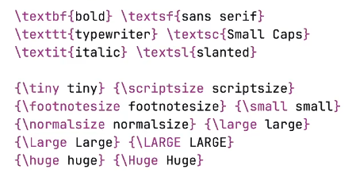

### 字符与标点
- 西文语境下的引号要这么打：``double''
  - 中文语境下正常输入即可
- 连字符：-、 短破折号：--、 长破折号：---
- 防止西文连字 dif{}f{}icult

### 强制行距/间距
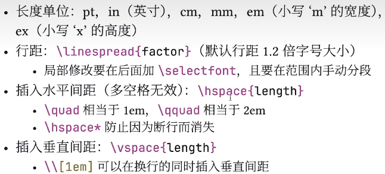

### 标题页
在导言区
- \title{title}：标题
- \author{author}：作者
- \date{date}：日期，不写则默认为当前日期\today
在正文区使用\maketitle生成标题页

### 环境
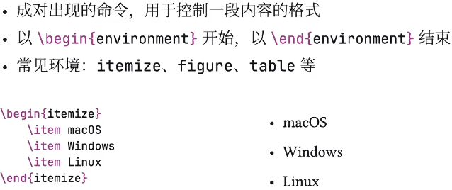

### 章节和目录
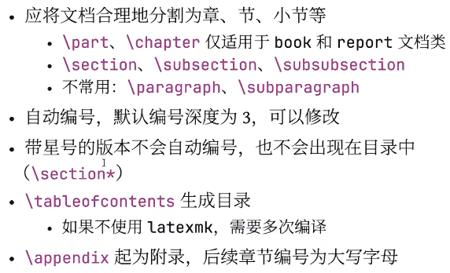

### 图片
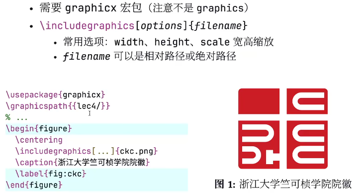
### 浮动体
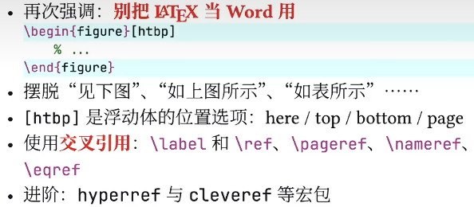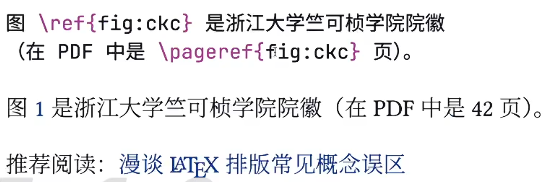

### 数学模式
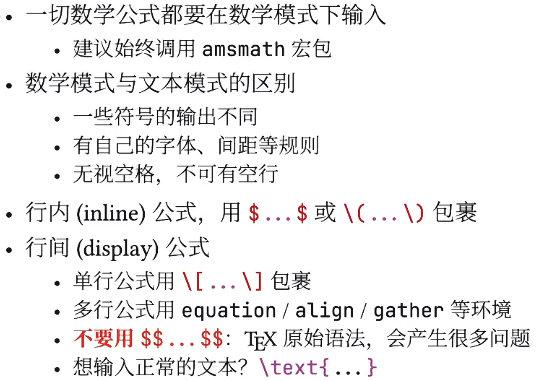
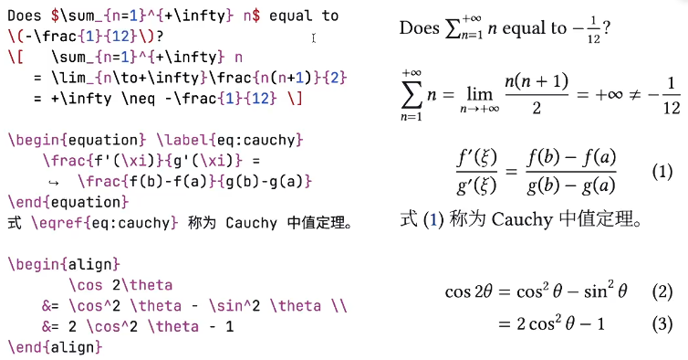
> align环境下&可以用来对齐
> \begin{align*}可以取消每行编号

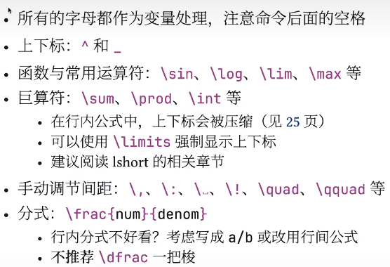
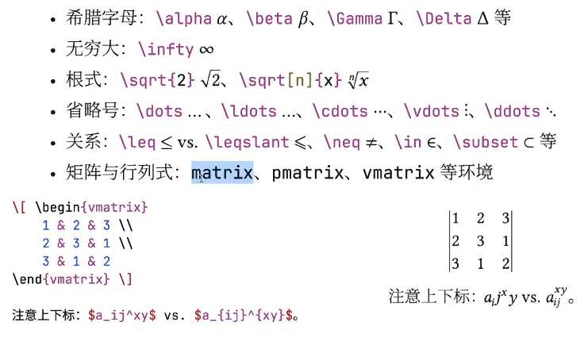
\vdots  vertical垂直的
\ddots  diagonal

### 括号与定界符
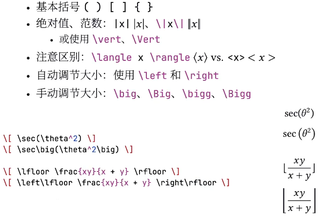

### 特殊数学字体
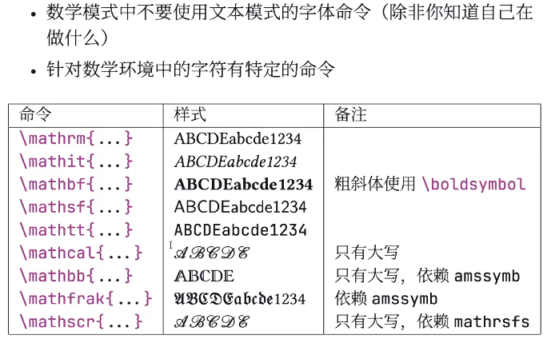
### 规范写法
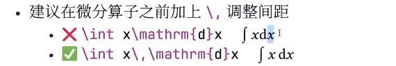
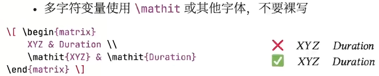

### 列表
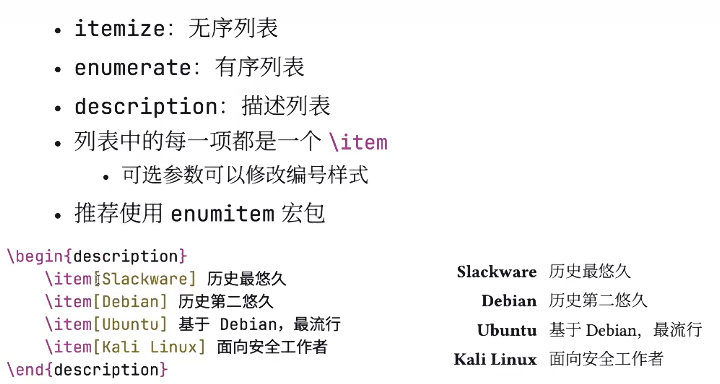

### 对齐环境
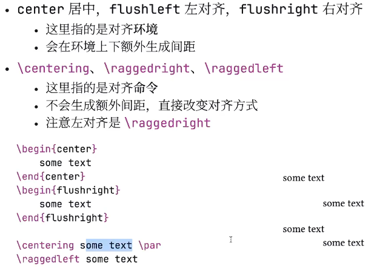

### 代码环境
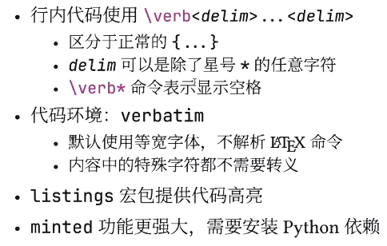


